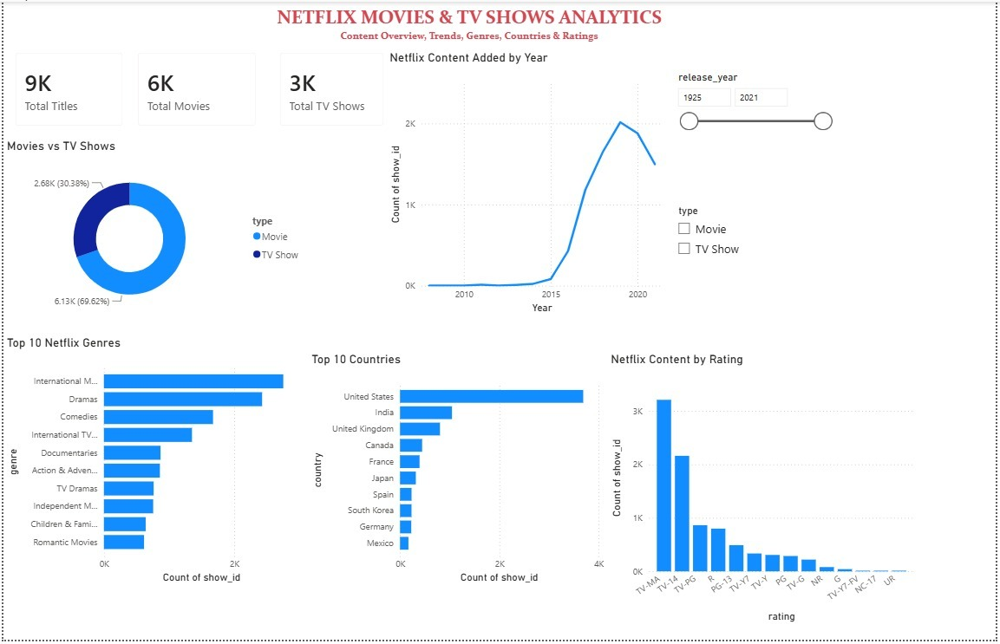
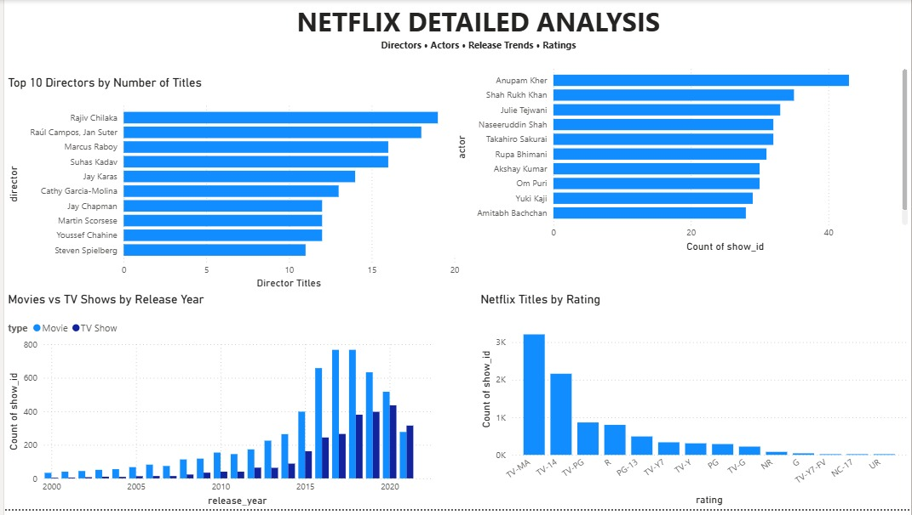

# Netflix Movies & TV Shows Analytics Dashboard

An end-to-end data analytics project using **MySQL and Power BI** to analyze Netflix Movies and TV Shows.

The project covers data cleaning, SQL-based exploratory analysis, data normalization, relational data modeling, and interactive dashboard development.

---

## 📌 Project Overview

This project analyzes the Netflix Movies and TV Shows dataset to identify patterns and trends in Netflix's content library.

The analysis focuses on:

- Movies vs TV Shows
- Content added over time
- Popular genres
- Countries producing Netflix content
- Content ratings
- Top directors
- Top actors
- Release-year trends

The raw Netflix dataset was loaded into **MySQL**, analyzed and normalized using SQL, and then connected to **Power BI** to create interactive dashboards.

---

## 🎯 Project Objectives

The main objectives of this project are:

1. Analyze the distribution of Movies and TV Shows on Netflix.
2. Identify the most common genres.
3. Identify countries with the highest number of Netflix titles.
4. Analyze Netflix titles by rating.
5. Identify directors with the highest number of titles.
6. Identify actors with the highest number of appearances.
7. Analyze how Netflix content has changed over the years.
8. Build an interactive Power BI dashboard for data visualization and exploration.

---

## 🛠️ Technologies Used

| Technology | Purpose |
|---|---|
| **MySQL 8.0** | Database management and SQL analysis |
| **MySQL Workbench** | SQL development and database management |
| **Power BI Desktop** | Interactive dashboards and visualization |
| **SQL** | Data cleaning, transformation and analysis |
| **DAX** | Measures and Power BI calculations |
| **GitHub** | Project version control and documentation |

---

## 📊 Dataset

The project uses the **Netflix Movies and TV Shows** dataset.

The dataset contains approximately **8,807 titles** and includes information such as:

- `show_id`
- `type`
- `title`
- `director`
- `casts`
- `country`
- `date_added`
- `release_year`
- `rating`
- `duration`
- `listed_in`
- `description`

The original CSV file is available in:

`Dataset/netflix_titles.csv`

---

## 📸 Dashboard Preview

### Main Dashboard



### Detailed Analysis



---

## 💡 Key Insights

- **8,807** Netflix titles are present in the dataset.
- **6,131 Movies** and **2,676 TV Shows** are included.
- Movies represent approximately **69.62%** of the catalog.
- TV Shows represent approximately **30.38%**.
- The **United States** has the highest number of titles.
- **International Movies** and **Dramas** are among the most common genres.
- **TV-MA** is the most common rating.
- Netflix content increased significantly during the late 2010s.

---

## 📁 Project Structure

```text
Netflix-SQL-PowerBI-Analytics
│
├── README.md
├── Dataset
│   ├── README.md
│   └── netflix_titles.csv
├── PowerBI
│   ├── README.md
│   └── Netflix_Analytics_Dashboard.pbix
├── SQL
│   ├── 01_database_setup.sql
│   ├── 02_data_cleaning.sql
│   ├── 03_genre_analysis.sql
│   ├── 04_country_analysis.sql
│   └── 05_cast_analysis.sql
└── Screenshots
    ├── README.md
    ├── main_dashboard.jpeg
    └── detailed_analysis.jpeg
